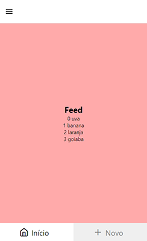

# Instalação

## Instalação dos pacotes

```powershell
npx create-expo-app nome_projeto --template
> Blank
cd nome_projeto

# para iniciar resetando o cache
npm start --reset-cache

# para atualizar os pacotes
npm audit fix --force && yarn upgrade expo && npx expo upgrade
```

package.json

```json
{
	"name": "navigation_js",
	"version": "1.0.0",
	"main": "node_modules/expo/AppEntry.js",
	"scripts": {
		"start": "expo start",
		"android": "expo start --android",
		"ios": "expo start --ios",
		"web": "expo start --web"
	},
	"dependencies": {
		"@expo/webpack-config": "^18.0.1",
		"@react-navigation/bottom-tabs": "^6.5.8",
		"@react-navigation/drawer": "^6.6.3",
		"@react-navigation/native": "^6.1.7",
		"@react-navigation/native-stack": "^6.9.13",
		"expo": "^48.0.19",
		"expo-status-bar": "~1.4.4",
		"react": "18.2.0",
		"react-dom": "18.2.0",
		"react-native": "0.71.8",
		"react-native-gesture-handler": "~2.9.0",
		"react-native-reanimated": "2.14.4",
		"react-native-safe-area-context": "4.5.0",
		"react-native-screens": "~3.20.0",
		"react-native-web": "~0.18.11"
	},
	"devDependencies": {
		"@babel/core": "^7.20.0"
	},
	"private": true
}
```

babel.config.js

```js
module.exports = function (api) {
	api.cache(true);
	return {
		presets: ['babel-preset-expo'],
		plugins: ['react-native-reanimated/plugin']
	};
};
```

```powershell
yarn install
```

## Criando as Páginas

```powershell
# crie uma pasta de source:
mkdir src

# crie as pastas
mkdir src/routes
mkdir src/screens
mkdir src/api
```

App.js

```js
import 'react-native-gesture-handler';
import Routes from './src/routes';

export default function App() {
	return <Routes />;
}
```

src/routes/index.js

```js
import React, { createContext, useState } from 'react';
import { NavigationContainer } from '@react-navigation/native';
import DrawerRoutes from './drawer.routes';
import { FruitProvider } from '../api/FruitContext';

export default function Routes() {
	return (
		<NavigationContainer>
			<FruitProvider>
				<DrawerRoutes />
			</FruitProvider>
		</NavigationContainer>
	);
}
```

src/routes/drawer.routes.js

```js
import { createDrawerNavigator } from '@react-navigation/drawer';
import { Feather } from '@expo/vector-icons';

import TabRoutes from './tab.routes';
import StackRoutes from './stack.routes';

const Drawer = createDrawerNavigator();

export default function DrawerRoutes() {
	return (
		<Drawer.Navigator screenOptions={{ title: '' }}>
			<Drawer.Screen
				name="home"
				component={TabRoutes}
				options={{
					drawerIcon: ({ color, size }) => (
						<Feather name="home" color={color} size={size} />
					),
					drawerLabel: 'Início'
				}}
			/>
			<Drawer.Screen
				name="profile"
				component={StackRoutes}
				options={{
					drawerIcon: ({ color, size }) => (
						<Feather name="user" color={color} size={size} />
					),
					drawerLabel: 'Meu perfil'
				}}
			/>
		</Drawer.Navigator>
	);
}
```

src/routes/tab.routes.js

```js
import { createBottomTabNavigator } from '@react-navigation/bottom-tabs';
import { Feather } from '@expo/vector-icons';

import Feed from '../screens/Feed';
import News from '../screens/News';

const Tab = createBottomTabNavigator();

export default function TabRoutes() {
	return (
		<Tab.Navigator
			screenOptions={{
				headerShown: false,
				tabBarShowLabel: true,
				tabBarActiveTintColor: 'black',
				tabBarInactiveTintColor: 'grey',
				tabBarActiveBackgroundColor: 'white',
				tabBarInactiveBackgroundColor: '#efefef',
				tabBarLabelStyle: {
					fontSize: 20
				},
				tabBarStyle: {
					borderTopWidth: 0,
					elevation: 0,
					borderColor: 'transparent',
					overflow: 'hidden'
					/*borderTopLeftRadius: 25,
					borderTopRightRadius: 25*/
				}
				/*style: {
					borderTopLeftRadius: 25,
					borderTopRightRadius: 25
				},*/
			}}
		>
			<Tab.Screen
				name="Feed"
				component={Feed}
				options={{
					tabBarIcon: ({ color, size }) => (
						<Feather name="home" color={color} size={size} />
					),
					tabBarLabel: 'Início'
				}}
			/>
			<Tab.Screen
				name="News"
				component={News}
				options={{
					tabBarIcon: ({ color, size }) => (
						<Feather name="plus" color={color} size={size} />
					),
					tabBarLabel: 'Novo'
				}}
			/>
		</Tab.Navigator>
	);
}
```

src/routes/stack.routes.js

```js
import { createNativeStackNavigator } from '@react-navigation/native-stack';

import Profile from '../screens/Profile';

const Stack = createNativeStackNavigator();

export default function StackRoutes() {
	return (
		<Stack.Navigator screenOptions={{ headerShown: false }}>
			<Stack.Screen name="Profile" component={Profile} />
		</Stack.Navigator>
	);
}
```

src/screens/Feed.js

```js
import { useContext } from 'react';
import { StyleSheet, Text, View, TouchableOpacity } from 'react-native';
import { FruitContext } from '../api/FruitContext';

export default function Feed() {
	const global = useContext(FruitContext);
	return (
		<View style={styles.container}>
			<Text style={styles.title}>Feed</Text>
			{global.fruits.map((item, index) => (
				<TouchableOpacity
					key={index}
					onPressOut={() => global.moveUp(index)}
				>
					<Text>
						{index} {item}
					</Text>
				</TouchableOpacity>
			))}
		</View>
	);
}

const styles = StyleSheet.create({
	container: {
		flex: 1,
		backgroundColor: '#faa',
		alignItems: 'center',
		justifyContent: 'center'
	},
	title: {
		fontSize: 22,
		fontWeight: 'bold'
	}
});
```

src/screens/News.js

```js
import { StyleSheet, Text, View } from 'react-native';

export default function News() {
	return (
		<View style={styles.container}>
			<Text style={styles.title}>News</Text>
		</View>
	);
}

const styles = StyleSheet.create({
	container: {
		flex: 1,
		backgroundColor: '#ddf',
		alignItems: 'center',
		justifyContent: 'center'
	},
	title: {
		fontSize: 22,
		fontWeight: 'bold'
	}
});
```

src/screens/Profile.js

```js
import { StyleSheet, Text, View } from 'react-native';

export default function Profile() {
	return (
		<View style={styles.container}>
			<Text style={styles.title}>Profile</Text>
		</View>
	);
}

const styles = StyleSheet.create({
	container: {
		flex: 1,
		backgroundColor: '#fda',
		alignItems: 'center',
		justifyContent: 'center'
	},
	title: {
		fontSize: 22,
		fontWeight: 'bold'
	}
});
```

src/api/FruitContext.js

```js
import React, { createContext, useState } from 'react';

export const FruitContext = React.createContext();

export const FruitProvider = ({ children }) => {
	const [fruits, setFruits] = useState([
		'uva',
		'banana',
		'laranja',
		'goiaba'
	]);

	const moveUp = (index) => {
		if (index > 0) {
			const newFruits = [...fruits];
			const temp = newFruits[index - 1];
			newFruits[index - 1] = newFruits[index];
			newFruits[index] = temp;
			setFruits(newFruits);
		}
	};

	const moveDown = (index) => {
		if (index < fruits.length - 1) {
			const newFruits = [...fruits];
			const temp = newFruits[index + 1];
			newFruits[index + 1] = newFruits[index];
			newFruits[index] = temp;
			setFruits(newFruits);
		}
	};

	return (
		<FruitContext.Provider value={{ fruits, moveUp, moveDown }}>
			{children}
		</FruitContext.Provider>
	);
};
```
